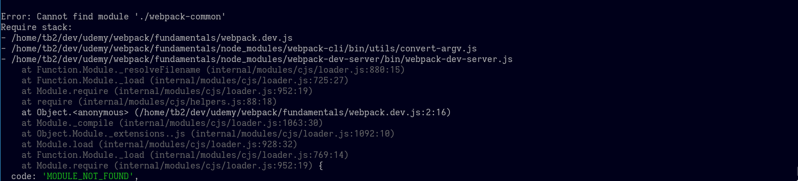

# Webpack 5 fundamentals

# Changelog

### [0.1] - 2021-01-17

> Initialisation of webpack [documentation webpack init](https://webpack.js.org/guides/development/#using-webpack-dev-server)

##### Added

- npm init -y
- npm install webpack webpack-cli --save-dev
- new file `src/index.js`

```javascript
console.log('hello from webpack');
```

- create `webpack.config.js` file alongside `src` folder

```javascript
const path = require('path');
module.exports = {
  entry = './src/index.js',
  output: {
    filename: 'main.js',
    path: path.resolve(__dirname, 'dist')
  }
}
```

##### Changed

- modify `package.json`

```javascript
    "build": "webpack"
```

### [0.2] - 2021-01-17

> Add webpack-dev-server and html-webpack-plugin

##### Added

> [documentation webpack dev server](https://webpack.js.org/guides/development/#using-webpack-dev-server)

- `npm install --save-dev webpack-dev-server`
- `npm install --save-dev html-webpack-plugin`

##### Changed

- `webpack.config.js`

```javascript

```

- `package.json`

```javascript
  "dev":"webpack-dev-server --open",
```

##### Changelog

### [0.3] - 2021-01-17

> Integrating with babel. [babel documents](https://babeljs.io/setup#installation)

##### Added

- `npm install --save-dev babel-loader @babel/core`
- `npm install --save-dev @babel/preset-env`
- create `.babelrc` or `babel.config.json` and add

```javascript
{
  "presets": ["@babel/preset-env"]
}
```

##### Changed

- `webpack.config.js`

```javascript
  module: {
    rules: [{ test: /\.js$/, exclude: /node_modules/, loader: 'babel-loader' }],
  },
```

- `src/index.js`

```javascript
const foo = (name) => {
  console.log(`Hello ${name}`);
};

foo('Robert');
```

### [0.4] - 2021-01-17

> Handle css files []()

##### Added

- 1 `npm install --save-dev style-loader css-loader`
- 2 `npm install --save-dev sass sass-loader`
- 4 `src.main.scss`

```sass
$bodyColour: red;

body{
  background-color: $bodyColour;
}
```

- 5 DO not forget to import it into your `index.js`.

##### Changed

- 3 `webpack.config.js`

```javascript
{test: /\.scss$/i, use:['style-loader', 'css-loader', 'sass-loader']}
```

### [0.5] - 2021-01-17

> Integrating `postcss-loader`

##### Added

- 1 `npm install --save-dev postcss-loader`
- 2 `npm install --save-dev cssnano autoprefixer rucksack-css`
- 3 `npm install --save-dev mini-css-extract-plugin`
- 4 `touch postcss.config.css`

```javascript
module.exports = {
  plugins: {
    autoprefixer: {},
    cssnano: {},
    'rucksack-css': {},
  },
};
```

- 6 create `.browserslistrc`

```
last 2 years
> 1%
not dead
```

##### Changed

- 5 `webpack.config.js`

```javascript
const MiniCssExtractPlugin = require('mini-css-extract-plugin');

{
  test: /\.scss$/i,
  use: [
    {
      loader: MiniCssExtractPlugin.loader,
      options: {
        hmr: process.env.NODE_ENV === 'development',
      },
    },
    ***~~'style-loader',~~
    'css-loader',
    'postcss-loader',
    'sass-loader',***
  ]
}

plugins: [
  // This plugin extracts css file from js files and put them in the appropriate named files.
  new MiniCssExtractPlugin({
    filename: '[name].css'
  })
],
```

**_~~'style-loader'~~,'css-loader','postcss-loader','sass-loader',_**

- 7 `src/main.scss`

```
body {
  display: grid;
  transition: all .5s;
  user-select: none;
  background: linear-gradient(to bottom, white, orange);
  font-size: responsive;
}
```

### [0.6] - 2021-01-17

> Split `webpack` config into two different files, `dev` and `prod`.

##### Added

- Add item

##### Changed

- 1 Duplicate `webpack.config.js` and create two separate files named `webpack.dev.js` and `webpack.prod.js`.
- 2 `package.json`

```javascript
"scripts": {
  "dev": "webpack-dev-server --open --config webpack.dev.js", "build":"NODE_ENV=production webpack --config webpack.prod.js"
}
```

- 3 `webpack.dev.js`

```javascript
module.exports = {
  mode: 'development',
  entry: './src/index.js',
  devtool: 'inline-source-map',
  devServer: {
    contentBase: './dist',
  },
  module: {
    rules: [
      { test: /\.js$/, exclude: /node_modules/, loader: 'babel-loader' },
      {
        test: /\.scss$/i,
        use: [
          { loader: 'css-loader', options: { sourceMap: true } },
          { loader: 'postcss-loader', options: { sourceMap: true } },
          { loader: 'sass-loader', options: { sourceMap: true } },
        ],
      },
    ],
  },
  plugins: [
    new HtmlWebpackPlugin({
      title: 'Development',
    }),
  ],
  output: {
    filename: 'bundle.js',
    path: path.resolve(__dirname, 'dist'),
  },
};
```

- 4 `webpack.prod.js`

```javascript
mode: 'production',
```

- 5 `postcss.config.js`

```javascript
if (process.env.NODE_ENV === 'production') {
  module.exports = {
    plugins: {
      autoprefixer: {},
      cssnano: {},
      'rucksack-css': {},
    },
  };
} else {
  module.exports = {
    plugins: {
      autoprefixer: {},
      'rucksack-css': {},
    },
  };
}
```

### [0.7] - 2021-01-17

> DRY

##### Added

- 1 `npm install --save-dev webpack-merge`
- 2 create `webpack.common.js`. copy and past one of available (ie `dev` or `prod`) configuration into it.

```javascript
const path = require('path');
var HtmlWebpackPlugin = require('html-webpack-plugin');

module.exports = {
  entry: './src/index.js',
  module: {
    rules: [{ test: /\.js$/, exclude: /node_modules/, loader: 'babel-loader' }],
  },
  plugins: [new HtmlWebpackPlugin()],
  output: {
    filename: 'bundle.js',
    path: path.resolve(__dirname, 'dist'),
  },
};
```

##### Changed

- 3 `webpack.dev.js`

```javascript
const { merge } = require('webpack-merge');
const common = require('./webpack-common');

module.exports = merge(common, {
  mode: 'development',
  devtool: 'inline-source-map',
  devServer: {
    contentBase: './dist',
  },
  module: {
    rules: [
      {
        test: /\.scss$/i,
        use: [
          { loader: 'css-loader', options: { sourceMap: true } },
          { loader: 'postcss-loader', options: { sourceMap: true } },
          { loader: 'sass-loader', options: { sourceMap: true } },
        ],
      },
    ],
  },
});
```

- 4 `webpack.prod.js`

```javascript
const { merge } = require('webpack-merge');
const common = require('./webpack.common');
var MiniCssExtractPlugin = require('mini-css-extract-plugin');

module.exports = merge(common, {
  mode: 'production',
  module: {
    rules: [
      {
        test: /\.scss$/i,
        use: [
          {
            loader: MiniCssExtractPlugin.loader,
          },
          'css-loader',
          'postcss-loader',
          'sass-loader',
        ],
      },
    ],
  },
  plugins: [
    new MiniCssExtractPlugin({
      filename: '[name].css',
    }),
  ],
});
```

## Errors

- Error: Cannot find module 'webpack-cli/bin/config-yargs'
  

:: webpack-cli v4 doesn't work with webpack-dev-server v3. CHeck your `package.json` file

- No 'hmr' option 

:: Note: HMR is automatically supported in webpack 5. No need to configure it.

- No template for dependency: CssDependency 

:: You forgot to load `MiniCssExtractPlugin` into your `webpack.config.js` file.

- You may need an appropriate loader to handle this file type, currently no loaders are configured to process this file. 

:: Have you provided the appropriate loader.
:: Check configuration of `package.json` to check that the correct `webpack` config is provided.

- Error: Cannot find module './webpack-common'

:: Naming error -- Check the imported file name

## Indexes

1. `cssnano`: minimises the css file
2. `.browserslistrc`: specifies supported browsers
3. source maps will allow you to debug code easily during development---it's available for both `js` and `css`.
4. common config is the shared config which the both `dev` and `prod` have in common.
